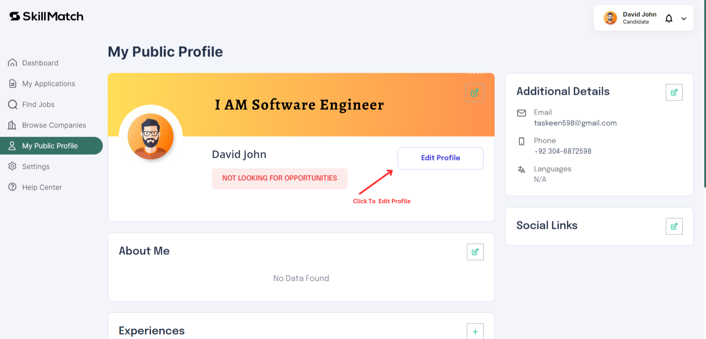

# Profile Management

### For Candidates (Job Seekers)

1. **Profile Creation**

   - **Step 1: Access Your Profile**
     - Log in to Skillmatch.tech with your registered account.
     - Navigate to the **My Public Profile** tab in your dashboard.
     - Update the Company Banner.
     

   - **Step 2: Add Profile Details**
     - Click on "Edit Profile" to add your personal information.
     

   - **Step 3: Save Your Profile**
     - Then add "Personal Information" Review your information and click on "Save Profile" to save changes.
     
   - **Step 4: Add Professional Details**
     - **Adding Experience, Education, and Skills**
       - Click on "Add Experience" or "Add Education" to include new entries.
       - Specify details such as job titles, company names, education institutions, and skills.

     - **Managing Portfolio**
       - Upload new portfolio items or remove existing ones.
       - Ensure your portfolio items are relevant and up to date.

     - **Updating Social Links and Profile Picture/Banner**
       - Edit or remove social links as necessary.
       - Change your profile picture or banner image to keep your profile fresh.

    