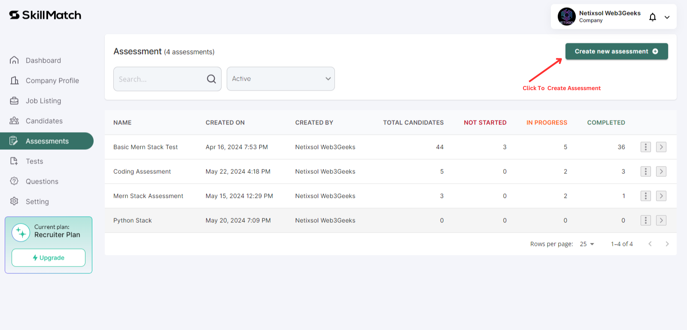
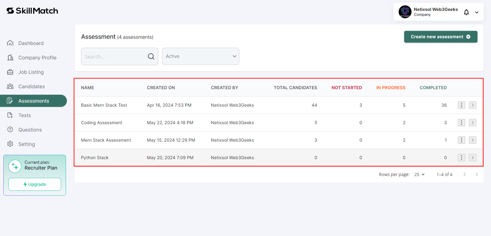

# Guide to creating an assessment 

    ## 1. Create Assessments
    **1.1** Navigate to the **Assessments** tab to create assessment tests for candidates.

    **1.2** Click on **Create New Assessments** button.
  
     

    **1.3** Specify assessment details such as test type, duration, and passing criteria.
  
     

    ## 2. Manage Assessments
    **2.1** Track assessment statuses (Not Started, In Progress, Completed) for each candidate.

    