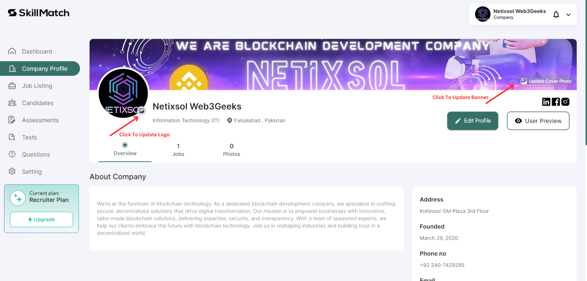

# Company Profile Management

### For Employers (Companies)

1. **Company Profile Management**:

   - **Step 1: Access Your Company Profile**
     - Log in to Skillmatch.tech with your registered company account.
     - Navigate to the **Company Profile** tab in your dashboard.
     - Update the Company Logo and Banner.
      

     - Click on "Company Profile > Edit Profile" to add information about company.
  

   - **Step 2: Edit Company Details**
     - Click on "Edit Profile" to start adding or updating company information.
     - Enter the following details:
       - **Basic Information:**
         - Company name, industry, location, company size.
       - **Social Links:**
         - Links to company LinkedIn page, Twitter handle, or official website.
       - **Save Your Company Profile**
         - Review your information and click on "Save" to save changes.
  
     