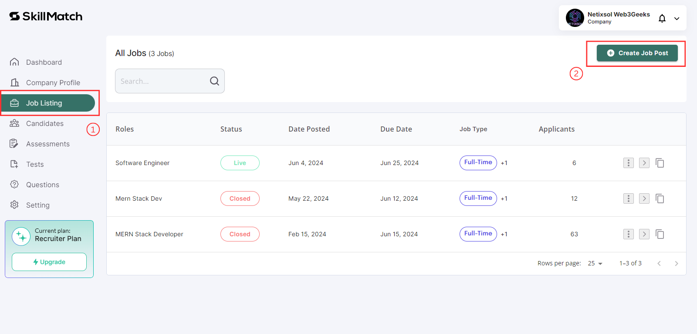
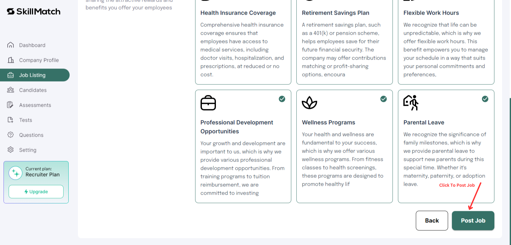

# Manage Job Postings

### For Employers (Companies)

Skillmatch.tech provides a straightforward process for creating and managing job postings to attract and hire talented candidates.

### Creating a Job Posting

1. **Access Your Company Dashboard**

   - Log in to Skillmatch.tech with your registered company account.
   - Navigate to the **Job Listing** tab in your dashboard.

2. **Create a New Job Posting**

   - **Step 1: Start Creating a Job Posting**

       Create and manage job listings under the "Job Listing" tab.
  
      **1.** Click on "Job Listing" tab.

      **2.** Click on "Create Job Post" button.

       
   
   - **Step 2: Job Information**
     - **Job Information:**
       - After click on "Create Job Post" button, Enter the job title, employment type (full-time, part-time, contract), category (e.g., IT, Marketing), and location (country and city).
  
       
  
     - **Job Description:**
       - Describe the job responsibilities, requirements, and qualifications.
       - Specify any special skills or certifications required.
  
       
     
     - **Perks and Benefits:**
       - Highlight any benefits or perks offered with the position (e.g., health insurance, remote work options, professional development).
  
       

   - **Step 3: Review and Publish**
     - Review the job posting details for accuracy.
     - Click on "Post Job" to make the job posting available to candidates.

       
