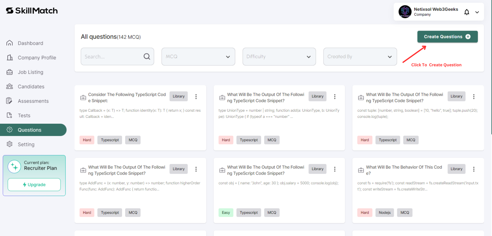
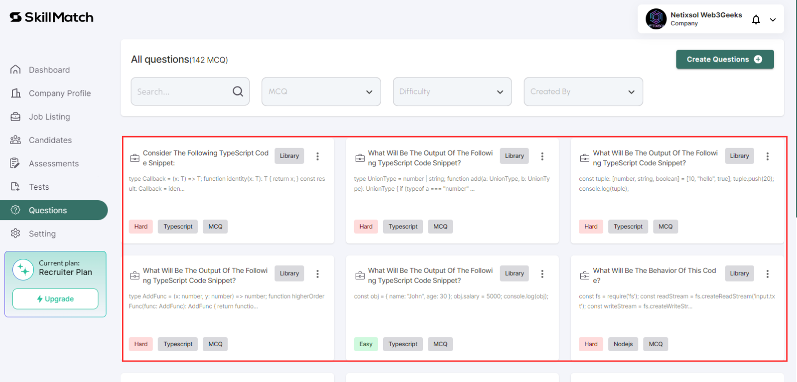

# Question Creation

   - **Step 1: Create Questions**
     - Navigate to the **Questions** tab to create tests for assessments.
     - Click on **Create Questions** button.
  
     

     - Specify question type and add title, descriptions, and options.
  
     

   - **Step 2: Manage Questions**
     - View all created questions.
  
    

