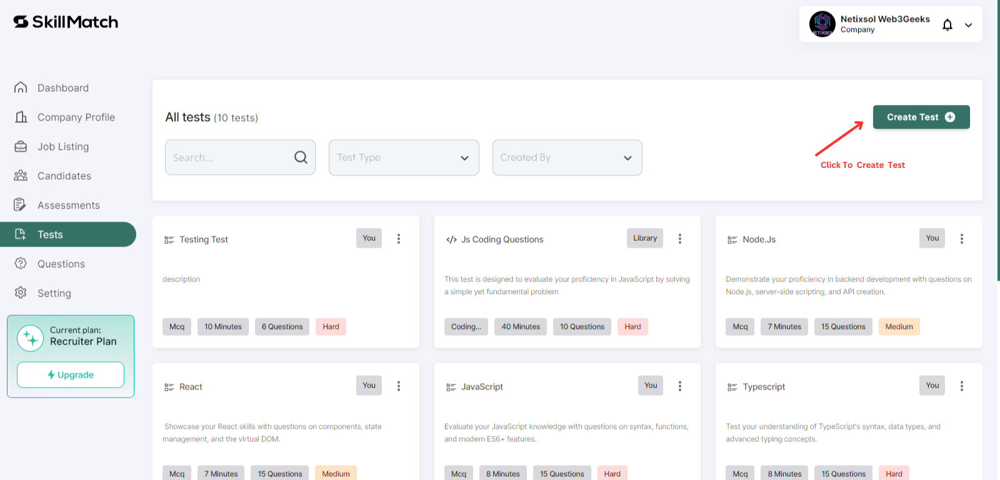
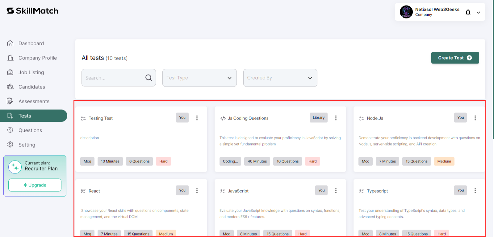

# Test Creation

   - **Step 1: Create Test**
     - Navigate to the **Tests** tab to create assessments for candidates.
     - Click on **Create Test** button.
  
     

     - Specify question title, description, language, tags, and questions.
  
     

   - **Step 2: Manage Test**
     - View all created tests.
  
    
