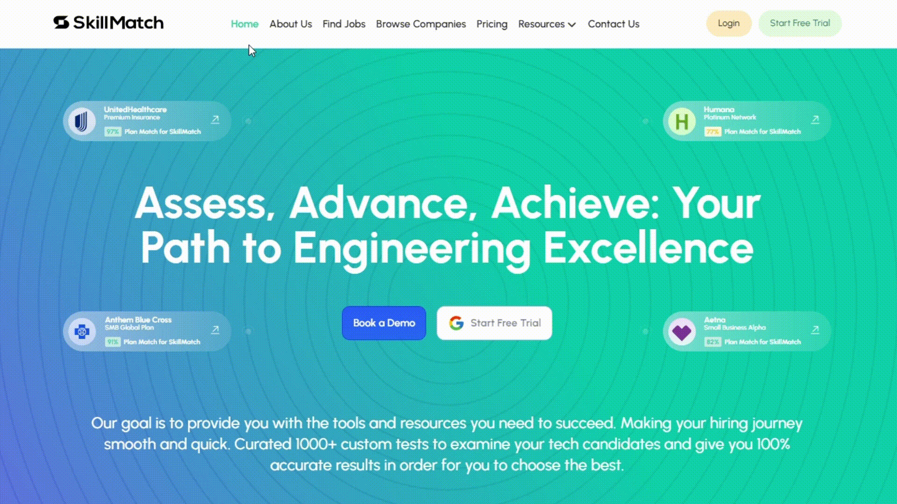

# Candidate Sign up

### For Candidates (Job Seekers)

1. **Accessing the Platform:**
   - Visit the Skillmatch.tech website or open the mobile application.

2. **Registration/Login Options:**
   - Click on "Login" to begin the registration process.
   - If you have already account then Choose one of the following login methods:
     - **Email:** Enter email address and create a password.
     - **Social Media Integration:** Login using Google, or GitHub.
   - If you don't have an account and want to register as candidate then click on "Sign up" and join us "Candidate".

  

3. **Support and Assistance:**
   - Contact Skillmatch.tech support through the Help Center if you encounter any issues.

Skillmatch.tech aims to provide a straightforward and user-friendly sign-up process for both candidates and employers, ensuring an efficient and effective job matching experience.