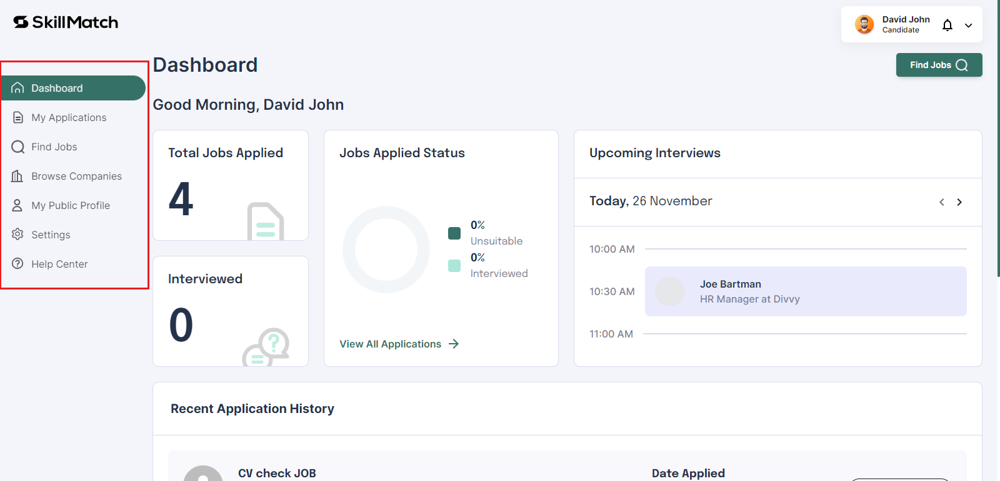
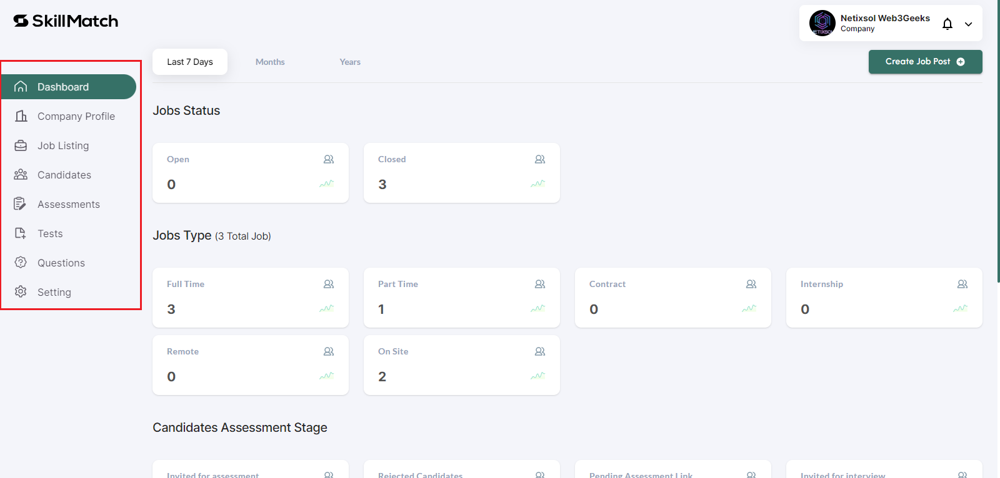
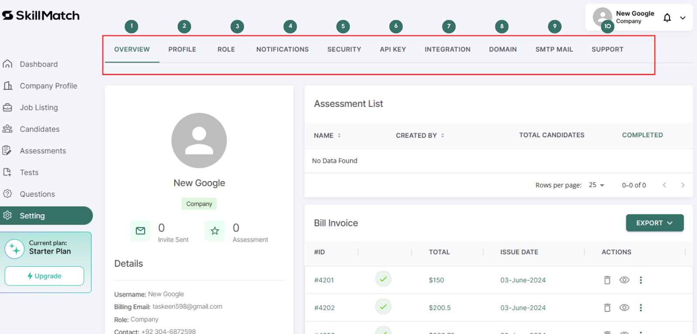

# Overview of Skillmatch

import LinkIconComponent from '/src/components/LinkComponent/LinkIconComponent.tsx';
import OverviewComponent from '/src/components/LinkComponent/OverviewComponent.tsx';
import { rows } from './Data/rows.ts';

Skillmatch.tech is an application designed to connect job seekers (candidates) with companies seeking talent. The platform offers an interactive and user-friendly interface with excellent user experience for both types of users. Here's a detailed overview of its features:

<LinkIconComponent url="https://www.skillmatch.tech/dashboard/candidate">
  ## **Candidate's Perspective**
</LinkIconComponent>

### Job Application Process
:::info

Candidate have two options either it can apply without having account on [skillmatch.tech](https://www.skillmatch.tech/signin) or with account on [skillmatch.tech](https://www.skillmatch.tech/signin), if have an account then candidate can apply from candidate's dashbaord. 

:::

### Without Account
:::tip

Creating an account on [skillmatch.tech](https://www.skillmatch.tech/signin) is essential, as you'll need it to access assessment links sent by employers. Setting up your account in advance showcases your professionalism and readiness. 

:::
     Candidates can apply for jobs **without logging in or registering.**
     They provide personal and professional details, including name, current job title, and CV.
     Companies receive these applications and can accept or reject them.
     Rejected candidates receive a rejection email, while accepted candidates are sent an assessment test.

### With Account:

Candidates must register via email, Google, or GitHub.
They gain access to an interactive dashboard where they can apply for jobs and view assessment tests.
### Dashboard Features
:::note

This is the ovreview of Candidate dashbaord. For better experience, create an account on [skillmatch.tech](https://www.skillmatch.tech/signin). 

:::

### Candidate Portal Tabs Overview

| **Tab Name**              | **Description**                                                                                                                                                          |
|---------------------------|--------------------------------------------------------------------------------------------------------------------------------------------------------------------------|
| **Dashboard Tab**         | Displays job applications, interviews, and status through graphs and charts.                                                                                            |
| **My Applications Tab**   | Shows seven types of application statuses with easy horizontal navigation.                                                                                                |
| **Find Jobs Tab**         | Lists all open and applied jobs with filters for employment type, categories, salary, job title, keyword, country, and city. Jobs can be viewed in grid or row format. |
| **Browse Companies Tab**  | Allows candidates to search for companies, view profiles, social links, and job openings. Jobs can be viewed in grid or row format.                                      |
| **My Public Profile Tab** | Candidates can add and edit descriptions, experiences, education, skills, portfolios, social links, profile picture, and profile banner.                                 |
| **Settings Tab**          | Contains personal details, CV/resume updates, email updates, password changes, and notification settings.                                                                |
| **Help Center Tab**       | Provides contact with the Skillmatch team for support and issue resolution.                                                                                               |

        

<LinkIconComponent url="https://www.skillmatch.tech/dashboard/company">
  ## **Company's Perspective**
</LinkIconComponent>

### Registration and Plans
:::info

The starter plan is free, you can add 2 Jobs and 20 invites for assessments for free. Visit [skillmatch.tech](https://www.skillmatch.tech/pricing-and-plan) for more details. 

:::
- Companies register and select from four installment types (monthly, quarterly, biannually, annually) and three plan types (starter, recruiter, enterprise). The default plan is the starter plan if no other is selected.

### Dashboard Features
:::note

This is the ovreview of Company dashbaord. For better experience, create an account on [skillmatch.tech](https://www.skillmatch.tech/signin). 

:::

### Admin Panel Tabs Overview

| **Tab Name**               | **Description**                                                                                                      |
|----------------------------|----------------------------------------------------------------------------------------------------------------------|
| **Dashboard Tab**          | Main interface with access to all functionalities.                                                                    |
| **Company Profile Tab**    | View and add company details, including logo, banner, photos, jobs, and social links.                                 |
| **Job Listing Tab**        | View and create jobs. Job creation involves adding job information, description, and perks and benefits.              |
| **Candidates Tab**         | View all candidates who applied for jobs.                                                                             |
| **Assessments Tab**        | Create and manage assessments. View candidate assessment statuses (Not Started, In Progress, Completed).               |
| **Tests Tab**              | Create tests with BASIC and ADVANCE options.                                                                          |
| **Questions Tab**          | View and filter questions by type, difficulty, and creator. Create new questions.                                     |

  

- **Settings Tab:** Contains:

<OverviewComponent rows={rows} />

**Here is Example**
  

Skillmatch.tech aims to streamline the job application process for candidates and simplify talent acquisition for companies with its comprehensive and well-designed platform.